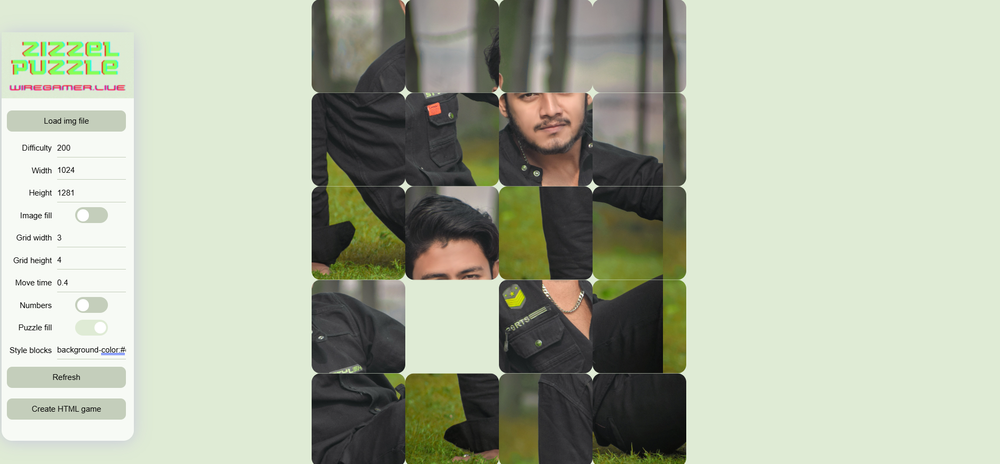

# wiregamer Sliding Puzzle maker for HTML 

A simple implementation of the classic mini-game wiregamer Sliding Puzzle, using HTML DOM document elements and without using Canvas or third party libraries. 

When mixing a picture, random replacement of slots is not used, only natural mixing by moving a free slot, thanks to this, an error is excluded, due to which the puzzle may not be assembled.

By solving the puzzle, you can move several blocks in a column and a row in one move. You can set controls for the GamePad and keyboard.


The engine code is very flexible for modifications, has many settings and can be integrated into any web page or web app.

# Structure

To use it, you need to create a div element with ID "wiregamer" and add an array with parameters, the script will do the rest itself. The script is very simple and you can easily add this mini-game to your web page.

```html
<html>
    <head>
    </head>
    <body>
        <div id='wiregamer'></div> <!--element "wiregamer" in which the game will take place-->
        <script>
        var setup={
             puzzle_wiregamer:{
                diff:300,           // Number of movements of the slots for shuffling pictures
                size:[512,640],     // Clement size "wiregamer" in pixels only
                grid:[3,3],         // The number of squares in the height and width of the picture
                fill:true,          // Stretching the area with the game to fit the element is recommended for fullscreen
                number:true,        // Slot sequence number
                art:{
                    url:"art.jpg",  // Path to the picture (you can use any format of supported browsers, gif-animation and svg)
                    ratio:false     // Enlarge the picture in height or width
                },
                // optional elements
                time:"0.1",         // block move animation time
                style:"border-radius:12px;", // style for puzzle square
                emptySlot:[1],      // Empty square number, defaults to the lower right quadrant.
                keyBoard:true,      // Control using the keys on the keyboard
                gamePad:true        // Control using the joystick on the Gamepad
             }
        }
        </script>
        <script src="wiregamer_puzzle.js"></script> <!--path to file engine-->
    </body>
</html>
```


# Editor / Demo

You can upload your image, set parameters and generate an html file with the game and your image. You can use the resulting file on your website or directly on your device, or you can modify it yourself, change the parameters, or write your own script that will run after the game is finished.


Editor features
- Automatic style adaptation based on image dimensions
- Proportional division of an image into blocks
- Building / exporting HTML file with the game
- Moving multiple blocks in one move
- Drag and Drop upload image

